# Torq-Pamba

Compliance-first AI UGC video studio: website-to-brief onboarding, avatars, chat agent, multi-model router (Omni Flash default), cost preview, approval gate and scheduling — no auto-posting, AI disclosure on by default.

[](https://github.com/pilotwaffle/Torq-Pamba/actions/workflows/ci.yml)
[](LICENSE)

## Demo

[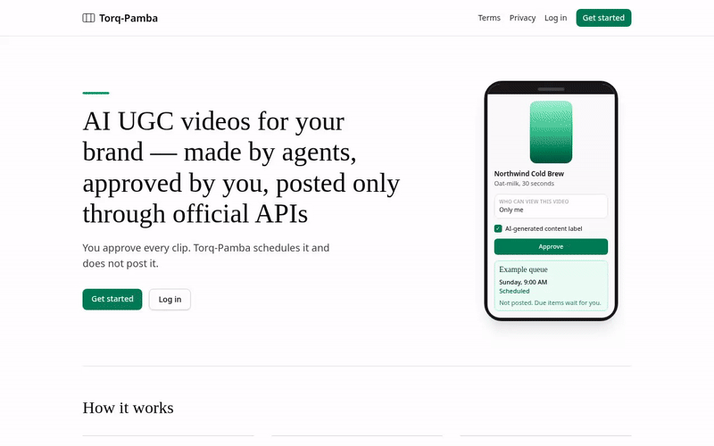](docs/media/demo.mp4)

The clip is the same mock-provider journey as the screenshots: public site, signup, onboarding the built-in demo company, avatar, chat cost preview, approval, and the schedule queue. Open the MP4 from the GIF.

## Screenshots

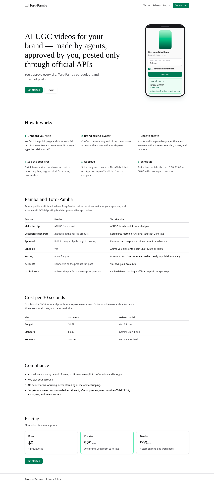

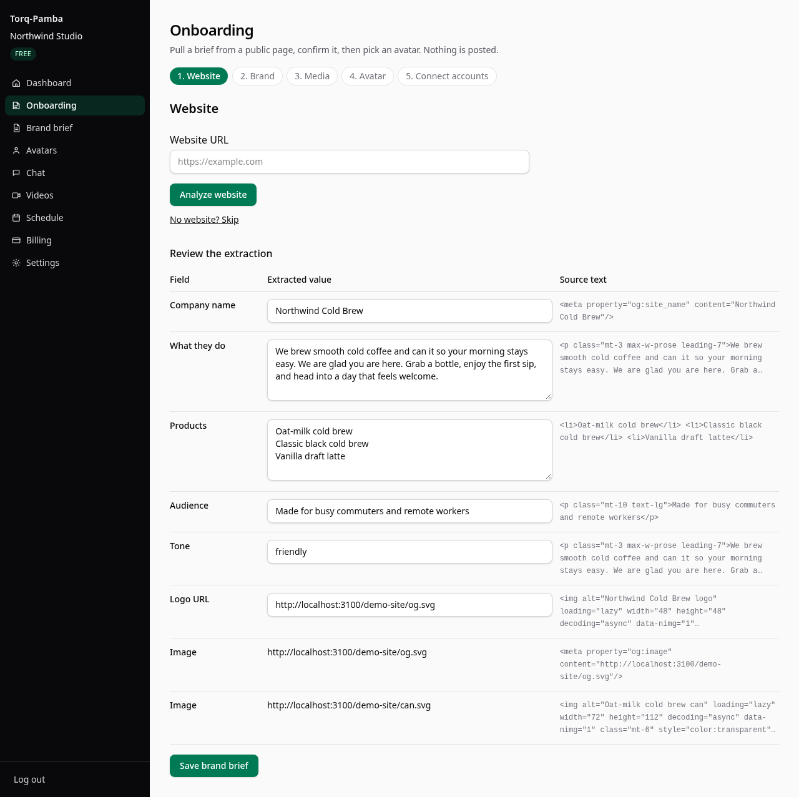

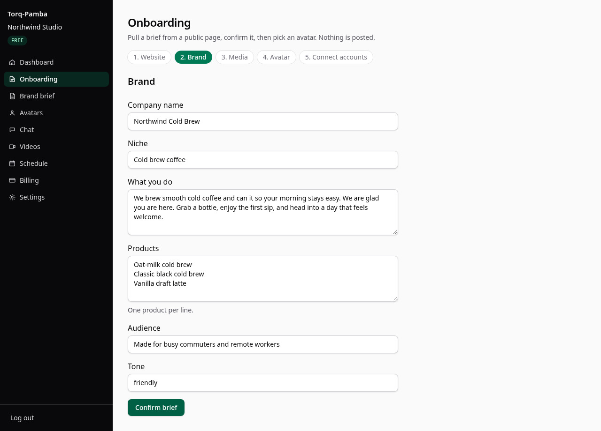

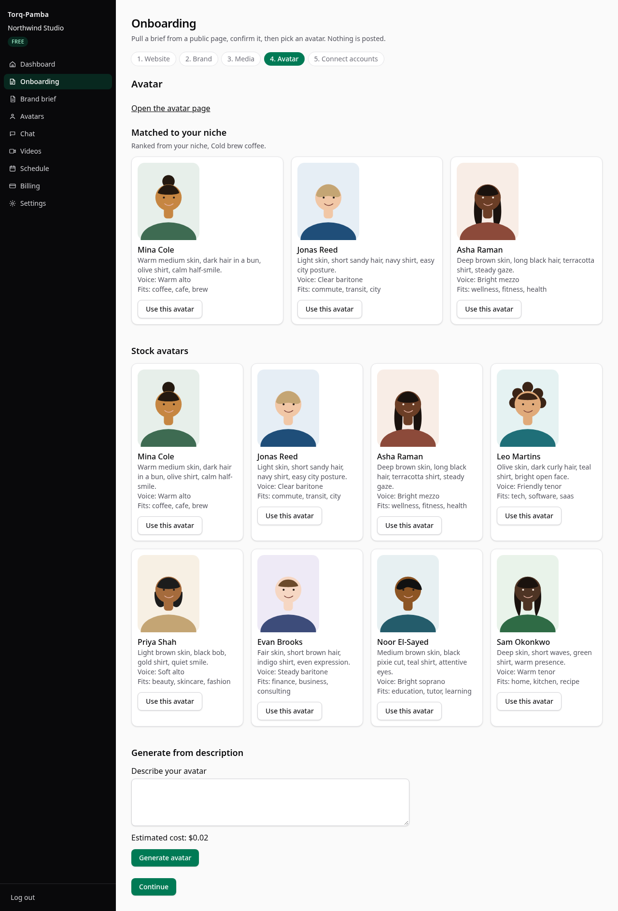

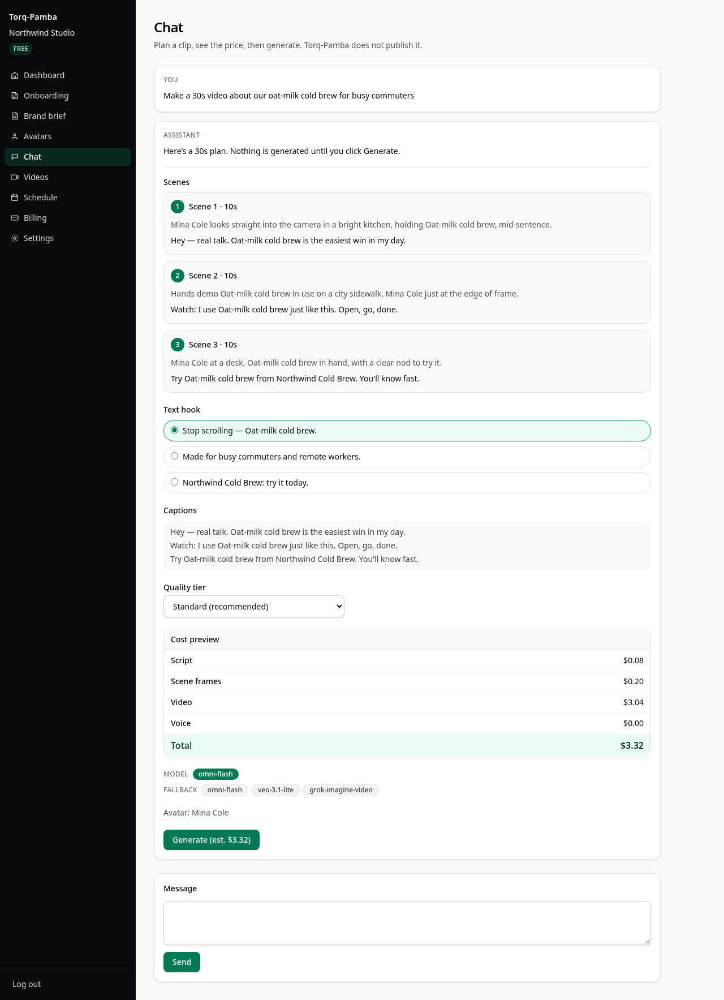

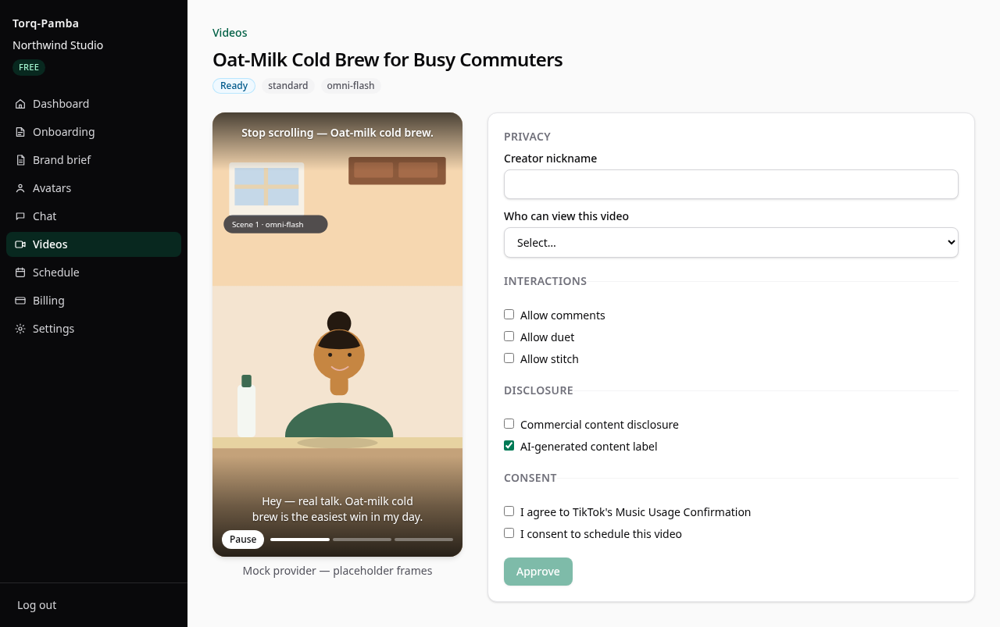

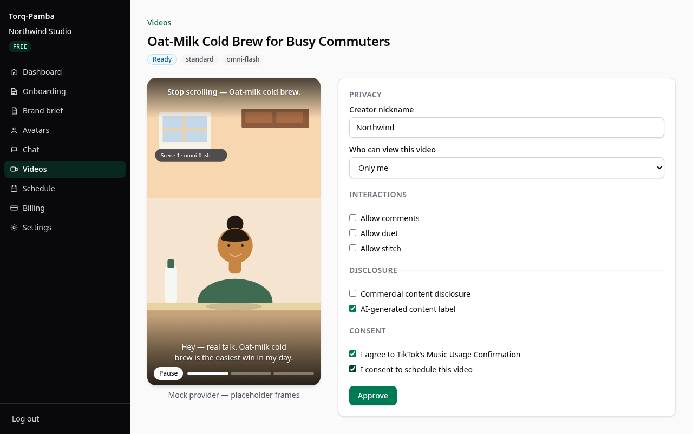

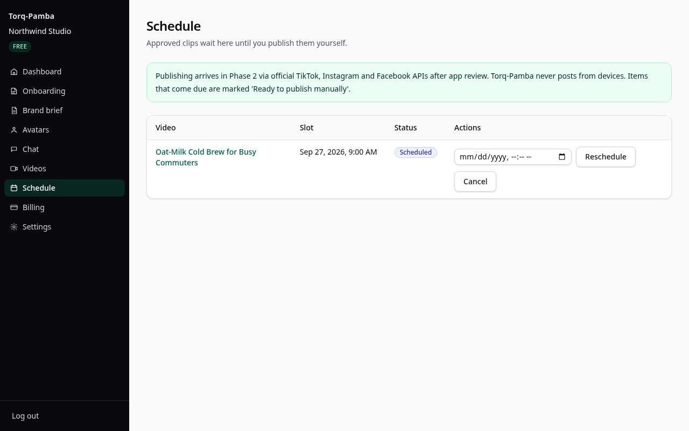

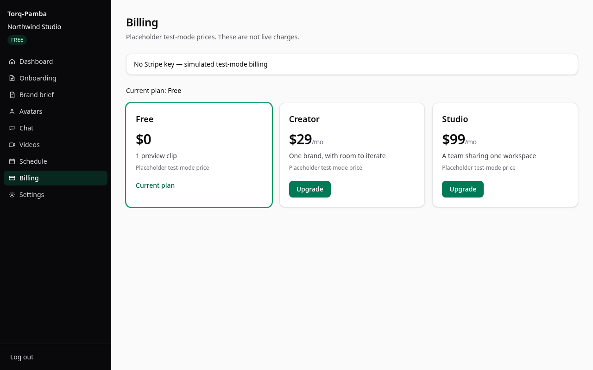

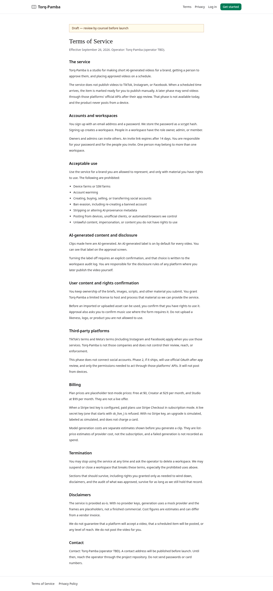

## What it is

Torq-Pamba is the Phase 0 and Phase 1 slice of a [Pamba](https://pamba.app) parity plan. It makes short AI UGC videos for a brand, requires a person to approve each one, and places approved videos on a schedule.

Phase 0 is the public site. `/`, `/terms`, and `/privacy` are real pages. Terms and Privacy are linked in the header and the footer without opening a menu.

Phase 1 is the studio:

- Website-to-brief onboarding, with a manual form when there is no site.
- Workspace avatars (eight stock portraits, or one generated from a text description).
- A chat agent that writes a three-scene plan, hooks, and captions, and shows the price before generation.
- A model router with budget, standard, and premium tiers. The default tier is standard, and the default model is Gemini Omni Flash.
- An approval screen, then a schedule queue.

Publishing is not in this phase. When a slot comes due, `processDueItems` sets the row to `due_manual` ("Ready to publish manually"). There is no publisher and no call to TikTok, Instagram, or Facebook.

With no API keys the app runs on the mock provider. Placeholder frames are labeled as such. The default monthly workspace budget cap is $25. A generation whose estimate exceeds the remaining cap is refused, and spend is recorded only for a successful clip.

## Feature list vs Pamba

Rows are from the parity matrix in the research report (26 September 2026). Status is what this repository does today.

| # | Pamba capability | Torq-Pamba Phase 1 | Status |
|---|---|---|---|
| 1 | Website-first onboarding: a URL becomes a company profile (what they do, products, audience, tone, logo), and the step can be skipped | The server fetches the page (http/https, 8s timeout, 1.5 MB cap) and shows each extracted field beside the source snippet. The user can edit every field. "No website? Skip" opens a manual form. Live extraction uses Gemini 3.8 Flash when `PROVIDER_MODE=live` and `GEMINI_API_KEY` is set; otherwise deterministic HTML heuristics | Beat |
| 2 | Brand step: confirm company name and niche; "what they do" is required when there is no website | The same fields are stored as the workspace brief. Company name and niche are required. The step is saved on the workspace so onboarding can resume | Match |
| 3 | Media step: site media plus extra uploads | Site images are imported and images can be added by URL. Each asset stays unused until the user checks "I have the rights to use this" | Match |
| 5 | Starter avatar: an LLM shortlist matched to the niche, or a generated avatar that spends image credits | Eight stock SVG avatars. A keyword shortlist is matched to the brief niche. A text description generates a deterministic SVG and shows the grok-imagine-image list price ($0.02) before it is saved. Each avatar belongs to one workspace | Beat |
| 10 | AI avatars ("creators"): community or custom, multiple scenes, exclusive to the workspace | Workspace-exclusive avatars with a name, look, stock voice, and scenes. Kling Avatar and HeyGen Avatar IV are registered adapters and are priced (see the cost section). The chat router’s default chains use the tier video models, not those avatar engines | Match |
| 12 | Chat agent as the main interface ("make me a video", "reschedule tomorrow’s post"), also exposed as MCP | `/app/chat` plans a video, schedules an approved video ("tomorrow at 9am" or the next good slot), and answers "what’s scheduled?". Every generation shows its price and waits for Generate. A remote MCP server is Phase 4 | Beat |
| 13 | Video pipeline: script, scene-by-scene footage, stitch, plus an editor for takes, captions, and text hooks | The agent writes a script split into three scenes, three text-hook variants, and captions from the script. Scenes generate in parallel, then a manifest stitches order, duration, caption track, and hook overlay. The preview is a frame slideshow. No Torq-Pamba logo or watermark is burned in. A separate multi-take editor is not in this phase | Match |
| 15 | Video models (Grok Imagine, Gemini Omni, Seedance, Nano Banana) with a safety-filter fallback to Grok Imagine | Router tiers below. Default is Omni Flash. Fallback is recorded per attempt. Sora is excluded. Kling 3.0 and Luma from the research notes are not adapters in this repo | Beat |
| 18 | Approval gate: nothing posts without sign-off | `/app/videos/[id]` previews the clip and asks for a creator nickname, a privacy choice with no default, interaction toggles that start off (comments, duet, stitch), commercial-content disclosure (your brand / branded content), an AI-generated label that starts on, music-usage consent, and express consent. Approve stays disabled until privacy is chosen and the consents are checked. An unapproved video cannot be scheduled | Match |
| 19 | Scheduling: the user picks a slot, or the product picks the next good slot | Approved videos take a chosen time or the next 09:00, 12:00, or 18:00 in the workspace timezone. `/app/schedule` lists, reschedules, and cancels. Due rows become `due_manual`. Nothing is sent to a platform | Match |
| 20 | Posting from real devices ("a real device opens TikTok or Instagram") | Official APIs only, and those calls are not in this repo. Device posting will not be built. Publishing through TikTok, Instagram, and Facebook official APIs is Phase 2 | Will not build |
| 25 | Credits and pricing: Free / Hobby / Pro, per-second credit rates, Stripe | Placeholder test-mode plans: Free $0 (labeled "1 preview clip"), Creator $29/mo, Studio $99/mo. Stripe Checkout runs only with a test secret. List-price clip cost is shown before Generate, and a failed generation is not recorded as spend. Retail margin is not set. The "1 preview clip" line is the plan label; the enforced limit is the monthly budget cap | Beat |
| 29 | Managed accounts: accounts created, warmed, and posted for the customer, with a dedicated phone and SIM | Will not build. A later phase can offer seats for accounts the customer already owns and connects with official OAuth. This repo stores no social accounts | Will not build |
| 30 | Account warming: automated browsing, likes, and follows | Will not build | Will not build |
| 31 | Accounts-page claims: real iPhones, US SIM cards, shadow-ban avoidance, automatic replacement, hundreds of accounts | Will not build | Will not build |
| 33 | Buying, selling, or transferring social accounts; sharing login credentials for accounts the vendor created | Will not build. The customer owns any account they later connect. This phase stores no OAuth tokens and does not sell or transfer accounts | Will not build |
| 35 | Acceptable use that leaves AI disclosure to the user | `aiGenerated` defaults to true on every video. The approval screen shows the label. Turning it off requires an explicit confirmation and writes an audit-log row. `/terms` and `/privacy` are published in the app | Beat |

## Architecture

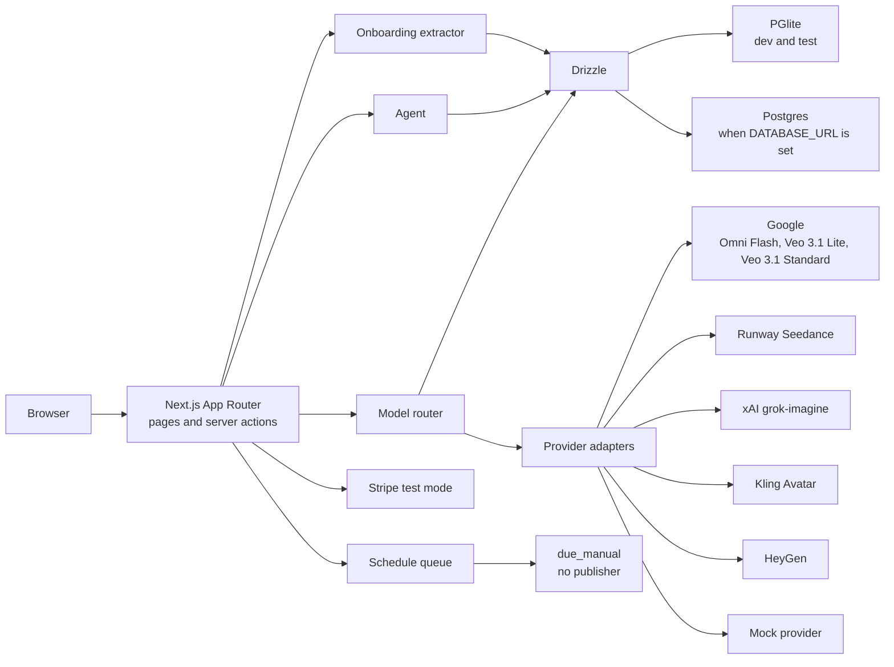

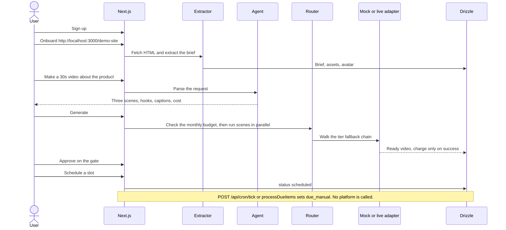

A shorter module map, and how to add a feature through the extension points, is in [docs/ARCHITECTURE.md](docs/ARCHITECTURE.md).

## Quickstart

Use Node 24. That is the version CI installs. `package.json` allows Node 22 or newer.

```bash
npm install
npm run setup
npm run dev
```

`npm run setup` copies `.env.example` to `.env.local` when that file is missing, then runs migrations. Leave the secrets empty. The app then uses the mock provider, embedded PGlite, and simulated billing.

Open [http://localhost:3000](http://localhost:3000), create an account, and onboard [http://localhost:3000/demo-site](http://localhost:3000/demo-site) (Northwind Cold Brew). Local and private addresses are fetchable when `NODE_ENV` is not `production`. Set `ALLOW_LOCAL_ONBOARDING=1` to allow them in production.

## Scripts

| Script | What it does |
|---|---|
| `npm run dev` | Next.js dev server (port 3000) |
| `npm run build` | Production build. Pages that touch the database are dynamic, so the build does not open a database |
| `npm run start` | Serve the production build |
| `npm run lint` | `eslint .` (ESLint 9 flat config) |
| `npm run typecheck` | `tsc --noEmit` |
| `npm test` | Vitest, in-memory PGlite. The script clears `DATABASE_URL` |
| `npm run test:e2e` | Playwright, Chromium, against a production server on port 3100 |
| `npm run capture` | The same journey, paced, writing `docs/images/*.png` and `docs/media/demo.webm` |
| `bash scripts/make-media.sh` | Turns `docs/media/demo.webm` into `demo.mp4` and `demo.gif`, then deletes the WebM |
| `npm run db:generate` | `drizzle-kit generate` into `./drizzle` |
| `npm run db:migrate` | Apply `./drizzle` (PGlite, or Postgres when `DATABASE_URL` is set) |
| `npm run setup` | Copy `.env.example` to `.env.local` if needed, then migrate |

## Environment variables

Every variable in `.env.example`. Empty means the default in the last column. Do not put live Stripe keys or real vendor secrets in that file.

| Variable | Required? | Default | Purpose |
|---|---|---|---|
| `DATABASE_URL` | No | empty | Postgres connection string (`node-postgres`). When empty, the app uses embedded PGlite |
| `PGLITE_DIR` | No | `./.data/pglite` | PGlite data directory. `memory` is in-memory and is what unit tests use |
| `PROVIDER_MODE` | No | `mock` | `mock` or `live`. Live vendor HTTP calls also need that vendor’s key. `NODE_ENV=test` never goes live |
| `ALLOW_LOCAL_ONBOARDING` | No | empty | Set to `1` to allow onboarding fetches of private or local IPs in production. Those fetches are already allowed when `NODE_ENV` is not `production` |
| `GEMINI_API_KEY` | No | empty | Google Gemini API for Omni Flash, Veo 3.1, Gemini 3.8 Flash extraction, and Gemini chat. Used only when `PROVIDER_MODE=live` |
| `ANTHROPIC_API_KEY` | No | empty | Claude Sonnet 5 for live chat. Live chat tries this key, then `XAI_API_KEY` (Grok 4.7), then `GEMINI_API_KEY` |
| `CHAT_AGENT_MODEL` | No | `claude-opus-5-5` | Claude model id for the tool-calling chat agent. The agent runs on Claude when `PROVIDER_MODE=live` and `ANTHROPIC_API_KEY` is set; otherwise chat uses the keyless command matcher |
| `RUNWAY_API_KEY` | No | empty | Runway, Seedance 2.0. Used only when `PROVIDER_MODE=live` |
| `XAI_API_KEY` | No | empty | xAI grok-imagine video and image, and Grok 4.7 chat. Used only when `PROVIDER_MODE=live` |
| `KLING_ACCESS_KEY` | No | empty | Kling avatar access key. Live calls need this and `KLING_SECRET_KEY` |
| `KLING_SECRET_KEY` | No | empty | Kling avatar secret. Used only when `PROVIDER_MODE=live` |
| `HEYGEN_API_KEY` | No | empty | HeyGen Avatar IV. Used only when `PROVIDER_MODE=live` |
| `ELEVENLABS_API_KEY` | No | empty | ElevenLabs text-to-speech, instant voice clones, and voice previews. Without it, voices use mock WAV audio. Used only when `PROVIDER_MODE=live` |
| `STRIPE_SECRET_KEY` | No | empty | Stripe test secret (`sk_test_…`). A value starting with `sk_live_` throws and checkout does not start. With no key, billing simulates a test-mode upgrade and labels it simulated |
| `STRIPE_PRICE_CREATOR` | No | empty | Stripe Price id for the Creator plan. Required only when a test secret is set and someone checks out Creator |
| `STRIPE_PRICE_STUDIO` | No | empty | Stripe Price id for the Studio plan. Same rule as Creator |
| `STRIPE_WEBHOOK_SECRET` | For the webhook | empty | Verifies `POST /api/billing/webhook`. When empty, the webhook returns 401 unless `ALLOW_INSECURE_LOCAL_ENDPOINTS=1` outside production |
| `CRON_SECRET` | For the cron tick | empty | `POST /api/cron/tick` requires `Authorization: Bearer <secret>`. When empty, the tick returns 401 unless `ALLOW_INSECURE_LOCAL_ENDPOINTS=1` outside production |
| `ALLOW_INSECURE_LOCAL_ENDPOINTS` | No | empty | Set to `1` on a local machine to run the cron tick and the webhook without their secrets. Ignored when `NODE_ENV` is `production` |
| `RESEARCH_SOURCE` | No | empty | Research data sources, comma-separated in order of preference: `youtube`, `scrapecreators`, `apify`. Empty or `mock` uses sample data. A live source also needs `PROVIDER_MODE=live` and its key |
| `YOUTUBE_API_KEY` | No | empty | YouTube Data API v3 key for research (official API, public channels and Shorts). Used only when `PROVIDER_MODE=live` |
| `SCRAPECREATORS_API_KEY` | No | empty | ScrapeCreators key for research on public TikTok and Instagram posts. Used only when `PROVIDER_MODE=live` |
| `APIFY_TOKEN` | No | empty | Apify token for research through the TikTok Scraper actor (public posts). Used only when `PROVIDER_MODE=live` |

`npm run capture` sets `CAPTURE=1` itself. That variable is not part of app configuration.

## Cost per 30-second clip

Figures below are the research report’s section 4B, computed from the section 4A list prices read on 26 September 2026. They are direct vendor cost (COGS) for one successful generation. They are not a retail price. The same arithmetic is what `estimateClipCost` in `src/lib/pricing.ts` returns for the budget, standard, and premium totals, the optional voice-over totals, the Kling alternative, and the HeyGen Avatar IV alternative. HeyGen Avatar V is in the research table and is not a registered adapter.

**Design caps (our choices, not measured).** A script and agent turn may use up to 20,000 input tokens and 4,000 output tokens per clip. Each clip uses 3 scene start frames. Costs are for one successful generation. The re-roll or retry rate is unknown, so real cost per kept clip will be higher by an unknown factor. Storage, encoding, bandwidth, and hosting costs are unknown and are not included. Whether Google bills Omni Flash audio separately is not stated on the pricing page, so the standard-tier voice line treats audio as included.

Gemini 3.8 Flash is $0.75 / $3.75 per 1M tokens through 31 December 2026 and doubles to $1.50 / $7.50 on 1 January 2027 (same Google pricing page). The budget script line uses the 2026 rate.

### Budget tier (Veo 3.1 Lite, model-native audio)

| Component | Math | Cost |
|---|---|---|
| Script (Gemini 3.8 Flash) | 20,000 × $0.75/1M = $0.015; 4,000 × $3.75/1M = $0.015 | $0.030 |
| 3 scene frames (grok-imagine-image) | 3 × $0.02 | $0.060 |
| Video with audio (Veo 3.1 Lite, 720p) | 30 s × $0.05/s | $1.500 |
| Voice | Included in "video with audio" price | $0.000 |
| **Total** | | **$1.59** |

*Budget alternative, lip-sync avatar:* Kling Avatar 30 × $0.056 = $1.68; ElevenLabs Flash 0.5K characters × $0.05 = $0.025; one avatar frame $0.02; script $0.03. **Total $1.76.**

There is no ElevenLabs adapter or API key in this repo. The voice lines are cost-model inputs. Stock voices on an avatar are labels, not a live text-to-speech call.

### Standard tier, the recommended default (Gemini Omni Flash)

| Component | Math | Cost |
|---|---|---|
| Script and agent (Claude Sonnet 5) | 20,000 × $2/1M = $0.04; 4,000 × $10/1M = $0.04 | $0.080 |
| 3 scene frames (Nano Banana 2, 1K) | 3 × $0.067 | $0.201 |
| Video (Omni Flash, 720p) | 5,792 tokens/s × 30 s = 173,760 tokens × $17.50/1M | $3.041 |
| Voice | Omni is ranked on the with-audio board. Whether Google bills audio separately is not stated, so treat it as included. Optional ElevenLabs v3 voice-over: 0.5K × $0.10 = $0.05 | $0.000 (or $0.05) |
| **Total** | | **$3.32** (or $3.37 with a separate voice-over) |

### Premium tier (Veo 3.1 Standard 1080p, or Seedance 2.0 1080p through Runway at the same $0.40/s)

| Component | Math | Cost |
|---|---|---|
| Script and agent (Claude Opus 5.5) | 20,000 × $4/1M = $0.08; 4,000 × $20/1M = $0.08 | $0.160 |
| 3 scene frames (Nano Banana Pro, 2K) | 3 × $0.134 | $0.402 |
| Video with audio (Veo 3.1 Standard, 1080p) | 30 s × $0.40/s (Seedance 2.0 on Runway: 40 credits × $0.01 × 30 = $12.00) | $12.000 |
| Voice-over (optional, ElevenLabs v3) | 0.5K × $0.10 | $0.05 |
| **Total** | | **$12.56** (or $12.61 with a voice-over) |

*Premium avatar alternatives:* HeyGen Avatar IV Photo Avatar 0.5 min × $2.31 = $1.155, plus voice-over $0.05 and script $0.08, **total $1.29**. HeyGen Avatar V Digital Twin 0.5 × $7.20 = $3.60, plus $0.05 and $0.08, **total $3.73**. HeyGen notes that creating a custom Digital Twin via the API is only available for Enterprise API users. The $0.08 script line on these two alternatives is the standard-tier script (Claude Sonnet 5), which is how section 4B states it.

### Comparison with Pamba (report section 4D)

Pamba retail equivalents use the plan rate of $10 per 1,000 credits and the published per-second rates of roughly 16 (Grok Imagine), 22 (Gemini Omni), and 53 (Seedance) credits, times 30 seconds: $4.80, $6.60, and $15.90. Sources: [Pamba credits and billing](https://pamba.app/help/credits-and-billing) and [Pamba MCP server help](https://pamba.app/help/mcp-server), read 2026-09-26.

| | Budget | Standard | Premium |
|---|---|---|---|
| **Our COGS at list price** | $1.59 (Veo Lite) | $3.32 (Omni Flash) | $12.56 (Veo 3.1 Standard or Seedance 2.0) |
| **Nearest Pamba retail equivalent** | $4.80 (Grok Imagine, cheapest listed rate) | $6.60 (Gemini Omni, same model family) | $15.90 (Seedance) |
| **Difference** | 67% lower | 50% lower | 21% lower |

These are our direct vendor costs set against Pamba's retail prices, so they show room for a lower price. They are not a like-for-like retail comparison. Retry rates, infrastructure costs, and our margin are unknown.

### Sources

All read 2026-09-26.

- Google Veo 3.1 Lite and Standard, Gemini Omni Flash, Nano Banana 2, Nano Banana Pro, Gemini 3.8 Flash: https://ai.google.dev/gemini-api/docs/pricing
- xAI grok-imagine-image and grok-imagine-video: https://docs.x.ai/developers/pricing
- Runway credits and Seedance 2.0: https://docs.dev.runwayml.com/guides/pricing/
- Kling Avatar: https://kling.ai/document-api/pricing/base/video.md
- HeyGen Avatar IV and Avatar V: https://help.heygen.com/en/articles/10060327-heygen-api-pricing-explained
- ElevenLabs v3 and Flash: https://elevenlabs.io/pricing/api
- Anthropic Claude Sonnet 5 and Opus 5.5: https://www.anthropic.com/pricing
- Pamba plan credit price: https://pamba.app/help/credits-and-billing
- Pamba per-second credit rates: https://pamba.app/help/mcp-server

## Model router

Each model's tier and chain position live on its entry in `src/lib/models/<vendor>.ts`; `src/lib/pricing.ts` derives `TIER_MODEL` and `FALLBACK_CHAIN` from them. The router walks the chain when a provider refuses or is unavailable, and it stores every attempt. The mock video provider refuses the first attempt when the prompt contains `[refuse]`, and every attempt when it contains `[refuse-all]`.

| Tier | Default model | List price | Fallback chain |
|---|---|---|---|
| Budget | `veo-3.1-lite` | $0.05/s, 720p with audio | veo-3.1-lite → grok-imagine-video → omni-flash |
| Standard (default) | `omni-flash` | 5,792 tokens/s × $17.50/1M = $0.10136/s | omni-flash → veo-3.1-lite → grok-imagine-video |
| Premium | `veo-3.1-standard` | $0.40/s, 1080p with audio | veo-3.1-standard → seedance-2-runway → omni-flash → grok-imagine-video |

Other registered rates, not on the default chains: grok-imagine-video $0.07/s at 720p (also the last-resort fallback above), Seedance 2.0 via Runway $0.40/s at 1080p (40 credits/s × $0.01), Kling Avatar $0.056/s at 720p, HeyGen Avatar IV $2.31/min ($0.0385/s).

Script models used in the estimate: budget Gemini 3.8 Flash ($0.75 / $3.75 per 1M input/output), standard Claude Sonnet 5 ($2 / $10), premium Claude Opus 5.5 ($4 / $20). Frame prices: budget grok-imagine-image $0.02, standard Nano Banana 2 $0.067, premium Nano Banana Pro $0.134, three frames per clip.

Live HTTP runs only when `PROVIDER_MODE=live` and that adapter’s key is set. Tests force the mock path.

## Compliance and product rules

These are enforced in code and covered by tests. Reviewers treat a violation as a defect. See [CONTRIBUTING.md](CONTRIBUTING.md).

1. No code path publishes to TikTok, Instagram, or Facebook. The schedule queue does not call TikTok Content Posting, Instagram `media_publish`, or Facebook `video_reels`. A due item becomes `due_manual`.
2. AI disclosure starts on. `aiGenerated` defaults to true. Turning it off on a video, or turning off the workspace default, requires an explicit confirmation and is written to `audit_log`.
3. The product has no device or SIM farm, no account warming, no account creation, sale, or transfer, no ban evasion, and no tool that strips AI-provenance metadata. The terms forbid those uses.
4. Stripe is test mode only. `sk_live_` keys throw before checkout or webhooks run. With no secret, checkout is a labeled simulation.
5. Provider adapters call the network only in live mode with a key, and never when `NODE_ENV` is `test`. The default mode is `mock`.

The schedule page states the same limit: publishing arrives in Phase 2 via official TikTok, Instagram, and Facebook APIs after app review, and Torq-Pamba never posts from devices.

## Out of scope (permanently)

Quoted from the research report, section 4E:

> Out of scope permanently: device or SIM farms, account creation for customers, warming, buying or selling accounts, re-creating banned accounts, and AI-provenance metadata stripping.

Not in this phase:

- Publishing (Phase 2)
- Reach engine (Phase 3)
- Public API and MCP (Phase 4)

## Phase 0

The in-repo site, terms, and privacy policy are the Phase 0 pages. Putting that site on a public URL, and opening the TikTok and Meta accounts, is a human owner’s work. This repository has not signed up for those programs.

The checklist, with the official links and the published lead times, is [docs/PHASE0-CHECKLIST.md](docs/PHASE0-CHECKLIST.md).

## Deploy

Vercel or Railway is enough for this phase.

1. Create a managed Postgres database and set `DATABASE_URL` to its connection string. Do not rely on the embedded PGlite directory on a host whose filesystem is ephemeral.
2. Run migrations (`npm run db:migrate`, or `npm run setup` on a machine that has the repo). The server also applies `./drizzle` on first use of `getDb()`.
3. Set `PROVIDER_MODE=mock` unless you intend to spend vendor credit. Live mode still does not publish.
4. Use a Stripe test secret only. Never set `sk_live_` in this phase. The billing module refuses it.
5. Set `CRON_SECRET` and call `POST /api/cron/tick` with `Authorization: Bearer <secret>` on a schedule if you want due items to flip to `due_manual` without someone opening the app. The handler does not publish.

`next.config.ts` marks `@electric-sql/pglite` as a server external package. Every page and route that touches the database sets `export const dynamic = "force-dynamic"`.

## Testing

- Unit: `npm test`. Vitest, Node environment, in-memory PGlite. Covers pricing totals, the router and fallback, approval rules, the schedule transition to `due_manual`, billing’s refusal of live Stripe keys, onboarding fetch guards, the v2 migration (no schema drift, workspace cascades, plan seeds), the model, provider, chat tool, and nav registries, the fail-closed cron and webhook endpoints, and a source scan that fails if a forbidden publish endpoint appears under `src/`.
- Postgres: CI also runs Vitest against Postgres 16 with `DATABASE_URL` set, one file at a time, because `npm test` itself clears `DATABASE_URL`.
- End to end: `npm run test:e2e`. Playwright drives Chromium through signup, the demo-site onboard, chat, approval, and the queue. The web server is a production build on port 3100 with `PROVIDER_MODE=mock`. Core specs are in `e2e/core/`; each feature adds `e2e/<feature>/` using the helpers in `e2e/support/`.
- Capture: `npm run capture`, then `bash scripts/make-media.sh`, refreshes `docs/images/` and `docs/media/`.

CI (`.github/workflows/ci.yml`) runs lint, typecheck, unit tests, the Playwright job, and the Postgres job on pushes to `main` and on pull requests. It installs Node 24.

## Roadmap

The build order for v2 (foundation, then six features in parallel, then publishing, analytics, and the API) is in [docs/V2-PLAN.md](docs/V2-PLAN.md).

From the research report, section 4E. Durations in that report’s timeline are prior estimates, except the approval lead times, which are the published figures in [docs/PHASE0-CHECKLIST.md](docs/PHASE0-CHECKLIST.md).

**Phase 2: Publish and measure on official APIs.** TikTok Direct Post with the required posting UX, and upload-to-drafts as a fallback. Instagram content publishing, including Trial Reels, and Facebook Page Reels. Analytics from TikTok `video.list` and Instagram insights. An audit log of publish status. Until TikTok’s audit passes, TikTok beta users are limited to 5 per 24 hours and posts stay private.

**Phase 3: Reach engine.** Hook-variant generation. Instagram Trial Reels as an organic hook test. A hand-off so the customer can run Spark Ads and partnership ads in their own Ads Manager. Creator sourcing through TikTok One and one UGC marketplace. Writing test winners back into the brand knowledge. Programmatic use of the TikTok and Meta marketing APIs is later, and its approval lead time is unknown.

**Phase 4: Platform.** A public REST API. A remote MCP server (OAuth 2.1, read-only mode, a spending cap). A managed done-with-you service in which the client stays the account owner and approves posts. Free marketing tools from matrix row 34, except a metadata scrubber, which stays on the permanent out-of-scope list.

## License

MIT. Copyright (c) 2026 Torq-Pamba contributors. The full text is [LICENSE](LICENSE).
